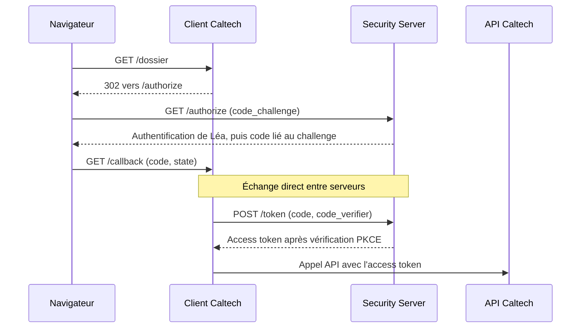

# OAuth 2.0 avec PKCE : le flux modifié

La requête initiale transporte l'empreinte. Le client présente la valeur d'origine lors de l'échange.

```mermaid
sequenceDiagram
    participant N as Navigateur
    participant C as Client Caltech
    participant S as Security Server
    participant A as API Caltech
    N->>C: GET /dossier
    C-->>N: 302 vers /authorize
    N->>S: GET /authorize (code_challenge)
    S-->>N: Authentification de Léa, puis code lié au challenge
    N->>C: GET /callback (code, state)
    Note over C,S: Échange direct entre serveurs
    C->>S: POST /token (code, code_verifier)
    S-->>C: Access token après vérification PKCE
    C->>A: Appel API avec l'access token
```

Comparer avec [[01-oauth2/flux-authorization-code]].
