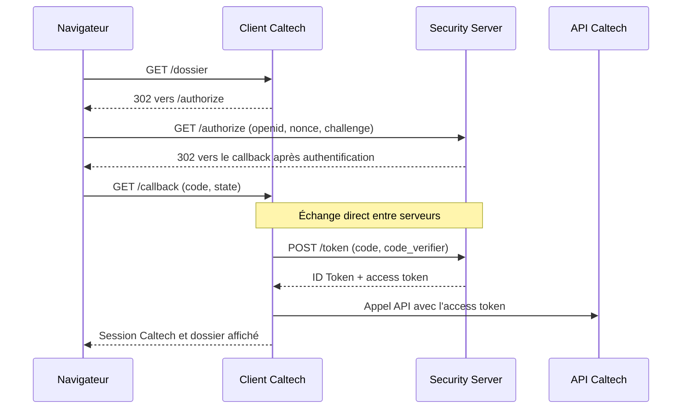

# OpenID Connect : le flux avec identité

OAuth 2.0 et PKCE restent en place. Le client reçoit la preuve d'identité à l'échange du code.

```mermaid
sequenceDiagram
    participant N as Navigateur
    participant C as Client Caltech
    participant S as Security Server
    participant A as API Caltech
    N->>C: GET /dossier
    C-->>N: 302 vers /authorize
    N->>S: GET /authorize (openid, nonce, challenge)
    S-->>N: 302 vers le callback après authentification
    N->>C: GET /callback (code, state)
    Note over C,S: Échange direct entre serveurs
    C->>S: POST /token (code, code_verifier)
    S-->>C: ID Token + access token
    C->>A: Appel API avec l'access token
    C-->>N: Session Caltech et dossier affiché
```
